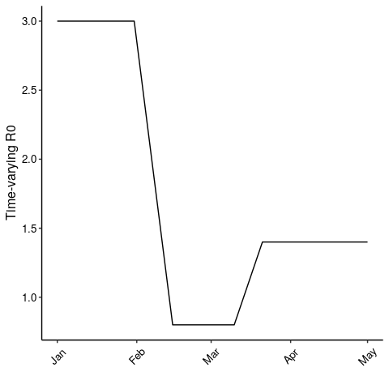
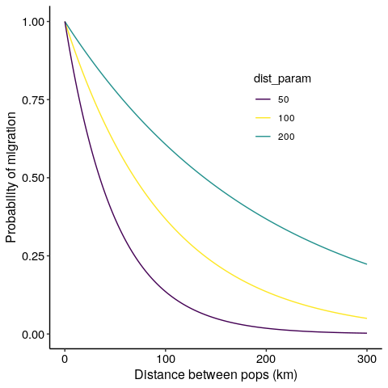
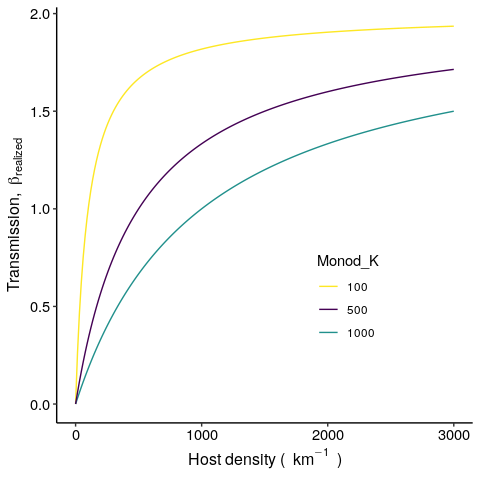

``` r
library(tidyverse)
library(viridis)
library(lubridate)
```

SPARSE-MOD: Overview and Key Features
-------------------------------------

SPARSE-MOD stands for **SPA**tial **R**esolution-**SE**nsitive
**M**odels of **O**utbreak **D**ynamics. Our goal with this R package is
to offer a framework for simulating the dynamics of stochastic and
spatially-explicit models of infectious disease. As we develop the
package, our goal is to add more model structures and more user-control
of the model dynamics. Our SPARSEMODr package offers several key features
that should make it particularly relevant for pedogogical and practical
use. See [our COVID-19 model vignette](https://sparsemod.nau.edu/rpkg/covid19)
for detailed walk-throughs of how to run the model, to plot the output, and to
simulate customized time-windows.

-   **Spatially explicit models** that allow user-defined
    meta-populations[1] characteristics and a customizable dispersal
    kernel (see below).

-   **Customizable process time-windows**: The user controls how the
    time-varying R0[2] and the dynamics of host migration change during
    the simulated outbreak. We have created `time_window` objects that
    allow users to simulate, for example, time periods over which public
    health or conservation interventions are implemented that can affect
    the effective contact between hosts or the movement of hosts among
    populations.

-   **Demographic stochasticity**[3] is built-in using a tau-leaping
    algorithm[4]. This captures the random transmission processes that
    are important early in outbreaks and especially in small host
    populations.

-   **Stochastic transmission** is also built-in, allowing daily
    fluctuations in the transmission rate, which can help account for
    dynamics like super-spreading or super-shedding.

-   The transmission process can be simulated as **frequency-dependent**
    (i.e., contact rates are invariable to population density) or
    **density-dependent** (i.e., contact rates depend on population
    density). For density-dependent transmission, we allow the user to
    custom-define a (non-)linear relationship between local host density
    and the transmission rate (see below).

-   Models are **coded in C++** and take advantage of Rcpp for rapid
    simulation of stochastic model trajectories across many focal
    populations.

In-depth…
---------

### Time windows

One of the benefits of the SPARSEMODr design is that the user can specify
how certain parameters of the model change over time. In this particular
example, we show how the time-varying R0 changes in a stepwise fashion
due to ‘interventions’ and ‘release of interventions’. We assume that
when a parameter value changes between two time windows, there is a
linear change over the number of days in that window. In other words,
the user specifies the value of the parameter acheived on the *last day*
of the time window. Note, however, that the user is allowed to supply
*daily* parameter values to avoid this linear-change assumption. Here we
show an example of a pattern of time-varying R0 that the user might
specify, and how the C++ code is essentially interpretting these values
on the back-end.

``` r
# Set up the dates of change. 5 time windows
n_windows = 5
# Window intervals
start_dates = c(mdy("1-1-20"),  mdy("2-1-20"),  mdy("2-16-20"), mdy("3-11-20"), mdy("3-22-20"))
end_dates   = c(mdy("1-31-20"), mdy("2-15-20"), mdy("3-10-20"), mdy("3-21-20"), mdy("5-1-20"))
# Time-varying R0
changing_r0 = c(3.0,            0.8,            0.8,            1.4,            1.4)

#R0 sequence
r0_seq = NULL

r0_seq[1:(yday(end_dates[1]) - yday(start_dates[1]) + 1)] =
  changing_r0[1]

for(i in 2:n_windows){

  r0_temp_seq = NULL
  r0_temp = NULL

  if(changing_r0[i] != changing_r0[i-1]){

    r0_diff = changing_r0[i-1] - changing_r0[i]
    n_days = yday(end_dates[i]) - yday(start_dates[i]) + 1
    r0_slope = - r0_diff / n_days

    for(j in 1:n_days){
      r0_temp_seq[j] = changing_r0[i-1] + r0_slope*j
    }

  }else{
    n_days = yday(end_dates[i]) - yday(start_dates[i]) + 1
    r0_temp_seq = rep(changing_r0[i], times = n_days)
  }

  r0_seq = c(r0_seq, r0_temp_seq)

}

# Create a data frame for plotting
## Date sequence:
date_seq = seq.Date(start_dates[1], end_dates[n_windows], by = "1 day")
r0_seq_df = data.frame(r0_seq, date_seq)
date_breaks = seq(range(date_seq)[1],
                  range(date_seq)[2],
                  by = "1 month")

ggplot(r0_seq_df) +
  geom_path(aes(x = date_seq, y = r0_seq)) +
  scale_x_date(breaks = date_breaks, date_labels = "%b") +
  labs(x="", y="Time-varying R0") +
  # THEME
  theme_classic()+
  theme(
    axis.text = element_text(size = 10, color = "black"),
    axis.title = element_text(size = 12, color = "black"),
    axis.text.x = element_text(angle = 45, vjust = 0.5)
  )
```



### Dispersal kernel

As we discuss in the documentation (see `?SPARSEMODr::Movement`), we
allow migration between populations in the meta-population to affect
local and regional transmission dynamics. For now, migration is
determined by a simple dispersal kernel, although we are working on
adding more customizable gravity kernels. The user can control the shape
of this kernel with the `dist_param` option, as follows:
$$ p\_{i,j} = \\frac{1}{\\text{exp}(d\_{i,j} / \\text{dist\_param})}, $$
where *p*<sub>*i*, *j*</sub> is the probability of moving from
population *j* to population *i* and *d*<sub>*i*, *j*</sub> is the
euclidean distance between the two populations.

We can see how the `dist_param` controls the probability below. In
general, larger values of `dist_param` make it more likely for hosts to
travel farther distances.



### Density-dependent Transmission

As we describe in the documentation (e.g., see
`?SPARSEMODr::covid19_model_interface`), we allow the user to implement
frequency-dependent or density-dependent (DD) transmission in the
SPARSEMODr models. For DD transmission, the user can specify a
(non-)linear Monod equation that describes the relationship between host
population density and the transmission rate *β* via the model’s
(optional) parameter, `dd_trans_monod_k`. The Monod equation is:
$$ \\beta\_{\\text{realized}} = \\beta\_{\\text{max}} \\frac{\\text{Dens}}{K + \\text{Dens}}, $$
where *β*<sub>max</sub> is the maximum possible transmission rate across
all densities, `Dens` is the density of the focal host population, and
*K* is a constant that controls the effect of density on the
transmission rate and is user-controlled by specifying
`dd_trans_monod_k`. More specifically, *K* is the half-velocity constant
at which point *β*<sub>realized</sub>/*β*<sub>max</sub> = 0.5.

We can see how `dd_trans_monod_k` controls the transmission rate below.
In general, larger values of `dd_trans_monod_k` mean that transmission
rate is more strongly limited by population density.



[1] A set of distinct, focal populations that are connected by migration

[2] Also known as the effective reproduction number or the instantaneous
R0 (Rt)

[3] The effects of probabilistic events that befall a population and
that can affect epidemic trajectories.

[4] Models are based off of differential equation models, but we use a
tau-leaping algorithm - in the Gillespie family - to simulate the model
one day at a time.
